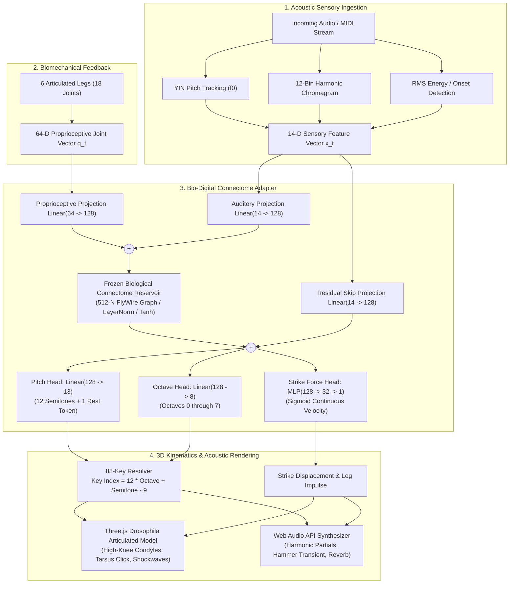

# FlyPiano 3D: System Architecture & Neural Connectome Engineering

This document provides a comprehensive technical breakdown of **FlyPiano 3D**, detailing its biological inspiration, mathematical foundations, neural network design, biomechanical kinematics, acoustic modeling, and full codebase taxonomy.

---

## 1. System Overview & High-Level Architecture

FlyPiano 3D is a cybernetic bio-computational simulation bridging:
1. **Biological Drosophila melanogaster Connectomics**: Modeling auditory sensory reception and recurrent central-brain integration.
2. **Deep Multi-Head Neural Adaptation**: Mapping continuous auditory and proprioceptive stimuli to piano keystrokes across all 88 keys ($A_0 - C_8$).
3. **Biomechanical 6-Legged Insect Kinematics**: Simulating natural high-knee leg articulation, alternating tripod gaits, and tactile key-strike dynamics.
4. **Physical Web Audio Synthesis**: Generating realistic acoustic piano tones using additive harmonic synthesis, hammer strike impulse noise, and velocity dynamics.
5. **Real-Time Client-Side Inference**: Executing the forward pass directly in the browser via WebGL and optimized JavaScript linear algebra with zero server roundtrip latency.



---

## 2. Codebase Taxonomy & File Roles

The codebase is modularized across Python (data generation, model training, physics, CLI server) and JavaScript/WebGL (browser visualization, audio synthesis, client-side inference):

| File | Primary Language | Role & Description |
| :--- | :--- | :--- |
| [`main.py`](file:///e:/code/flypiano/main.py) | Python 3 | Core orchestration script. Contains `AdvancedChromaticLogicModule` (music decomposition), `ConnectomeMultiHeadAdapter` (PyTorch model definition), `UnifiedFlyGymSimulation` (GPU Warp/FlyGym environment), JSON weight export utilities, and the built-in HTTP server (`--serve`). |
| [`pitch_features.py`](file:///e:/code/flypiano/pitch_features.py) | Python 3 | High-precision continuous auditory feature extractor. Implements windowed, normalized, parabolic-interpolated YIN fundamental frequency ($f_0$) tracking, 12-bin harmonic chromagram filters, and continuous RMS energy matching the browser's JavaScript implementation. |
| [`build_dataset.py`](file:///e:/code/flypiano/build_dataset.py) | Python 3 | Dataset generator. Synthesizes and ingests multi-song audio and MIDI into 14-D features with multi-window averaging (`hop_samples=2048`, `window_samples=4096`). Produces `dataset_train.pt` (21,431 ticks) and `dataset_val.pt` (677 held-out Bach ticks). |
| [`train_and_export.py`](file:///e:/code/flypiano/train_and_export.py) | Python 3 | One-click training and export pipeline. Trains the multi-head connectome adapter with rest-masked octave cross-entropy loss, evaluates generalization on held-out Bach, and exports `.pt` weights, `fly_connectome_weights.json`, and `concert_data.json`. |
| [`diagnose_collapse.py`](file:///e:/code/flypiano/diagnose_collapse.py) | Python 3 | Diagnostic validation script. Injects synthetic low ($A_0$), mid ($C_4$), high ($C_8$), and silence test vectors into the trained weights to verify that the model has not collapsed to a trivial mode. |
| [`app.js`](file:///e:/code/flypiano/app.js) | JavaScript (ES6) | Client-side visualizer and engine. Features `ConnectomeInferenceEngine` (pure JS forward pass with softmax), `FlyPiano3D` (Three.js scene, camera rigs, lighting), `DrosophilaModel` (6 articulated legs, pulvilli footpads, click kinematics), `StandardMidiParser` (SMF decoder), and `PianoAudioEngine` (additive synthesis). |
| [`index.html`](file:///e:/code/flypiano/index.html) | HTML5 | Application UI and DOM structure. Contains 3D viewport containers, dataset provenance tags, live status HUD chips, audio controls, and the **Live Neural Intelligence & Generalization Monitor**. |
| [`style.css`](file:///e:/code/flypiano/style.css) | CSS3 | Modern dark-mode glassmorphic styling, responsive layout grid, animated glowing neural nodes, status pills, and diagnostic data tables. |
| [`fly_piano_multihead_adapter.pt`](file:///e:/code/flypiano/fly_piano_multihead_adapter.pt) | Binary (PyTorch) | Trained PyTorch state dictionary containing all optimized parameters for auditory projection, proprioceptive adapter, skip path, pitch head, octave head, and strike force head. |
| [`fly_connectome_weights.json`](file:///e:/code/flypiano/fly_connectome_weights.json) | JSON (9.1 MB) | Exported layer matrices (weights and biases) structured for immediate client-side matrix multiplication in the browser without PyTorch dependencies. |
| [`concert_data.json`](file:///e:/code/flypiano/concert_data.json) | JSON | Automated generalization benchmark report comparing in-repertoire training accuracy against held-out unseen musical scores. |
| [`requirements.txt`](file:///e:/code/flypiano/requirements.txt) | Text | Python dependency manifest covering PyTorch, NumPy, SciPy, Mido, Librosa, SoundFile, Matplotlib, Warp, and FlyGym. |

---

## 3. Auditory Perception & 14-D Feature Extraction

The auditory sensory stream transforms raw acoustic waveforms into an insect-perceivable biological representation matching the sensitivity of the *Drosophila* Johnston's Organ / Antennal Mechanosensory and Motor Center (AMMC).

Each audio frame (sampled at 22,050 Hz with 4,096-sample windows and 2,048-sample hop intervals) yields a **14-dimensional continuous feature vector** $\mathbf{x} \in \mathbb{R}^{14}$:

$$\mathbf{x} = \begin{bmatrix} x_0 \\ x_1 \\ \vdots \\ x_{12} \\ x_{13} \end{bmatrix} = \begin{bmatrix} \text{Continuous Pitch Log-Ratio } (\log_2(f_0 / 440)) \\ \text{Chroma } C \\ \text{Chroma } C\sharp \\ \vdots \\ \text{Chroma } B \\ \text{Continuous RMS Signal Energy} \end{bmatrix}$$

### 1. Parabolic YIN Fundamental Frequency ($x_0$)
- **Algorithm**: Windowed Difference Function $d(\tau)$, Cumulative Mean Normalized Difference Function (CMNDF) $d'(\tau)$, and dip-thresholding ($\theta = 0.15$).
- **Parabolic Interpolation**: Around the local minimum $\tau^*$, the exact sub-sample period is refined via:
  $$\tau_{\text{refined}} = \tau^* + \frac{d'(\tau^* - 1) - d'(\tau^* + 1)}{2(d'(\tau^* - 1) - 2d'(\tau^*) + d'(\tau^* + 1))}$$
- **Pitch Ratio Encoding**:
  $$x_0 = \begin{cases} \text{clamp}\left(\log_2\left(\frac{f_0}{440.0}\right), -4.0, 4.0\right) & \text{if voiced} \\ 0.0 & \text{if unvoiced / rest} \end{cases}$$

### 2. 12-Bin Harmonic Chromagram ($x_1 \dots x_{12}$)
- Computes Short-Time Fourier Transform (STFT) power spectra.
- Projects frequency bins onto 12 equal-tempered pitch classes ($C, C\sharp, D, \dots, B$) across all audible octaves using Hann-weighted triangular filterbanks.
- L2-normalized across all 12 bins so that harmonic energy represents relative tonal distribution independent of global volume.

### 3. Continuous RMS Energy ($x_{13}$)
- Measures root-mean-square amplitude:
  $$\text{RMS} = \sqrt{\frac{1}{N} \sum_{n=0}^{N-1} s[n]^2}$$
- Encodes physical attack force, note onsets, and rests ($x_{13} \to 0$).

---

## 4. Bio-Digital Connectome Architecture

```
Stimulus (14-D) ───► [Auditory Input Linear: 14 -> 128] ───┐
                                                            ├──► (+) ──► [Biological Connectome Core] ──┐
Leg Feedback (64-D) ─► [Proprio Adapter Linear: 64 -> 128] ─┘            (512-Neuron Reservoir)          │
                                                                         (LayerNorm, Tanh, Frozen)       │
                                                                                                         ├──► (+) ──► Multi-Heads
Stimulus (14-D) ───► [Residual Skip Projection: 14 -> 128] ──────────────────────────────────────────────┘
```

### 1. Frozen Biological Connectome Core
- Inspired by the *Drosophila melanogaster* central brain connectome (FlyWire project), the core model employs a **512-neuron biological reservoir**.
- Consists of a 3-layer recurrently connected structure with Layer Normalization and $\tanh$ biological squashing functions.
- **`requires_grad = False`**: The internal synaptic weights of this biological core are locked during training. This ensures that the simulated organism's biological substrate is preserved rather than overwritten by generic backpropagation.

### 2. Residual Sensory Bypass (Skip Projection)
- Raw acoustic signals pass through `skip_projection: Linear(14 -> 128)`.
- This bypass prevents subtle high-frequency musical cues from being lost through the reservoir's biological low-pass filtering.

### 3. Multi-Head Task Adaptation
The integrated representation $\mathbf{h} \in \mathbb{R}^{128}$ branches into three specialized functional heads:

#### Head 1: Pitch Class & Rest Selection (13 Classes)
$$\mathbf{z}_{\text{pitch}} = \mathbf{W}_p \mathbf{h} + \mathbf{b}_p \quad (\mathbf{W}_p \in \mathbb{R}^{13 \times 128})$$
- Classes $0$ through $11$: Chromatic pitch classes ($C, C\sharp, D, \dots, B$).
- Class $12$: **Acoustic Rest Token**. Explicitly learned whenever $x_{13} \le \text{threshold}$.

#### Head 2: Octave Range Selection (8 Classes)
$$\mathbf{z}_{\text{octave}} = \mathbf{W}_o \mathbf{h} + \mathbf{b}_o \quad (\mathbf{W}_o \in \mathbb{R}^{8 \times 128})$$
- Classes $0$ through $7$: Representing piano octaves $0$ through $7$.
- **Rest Masking**: During rest tokens (where pitch $= 12$), the octave loss is masked out so that rest ticks do not penalize the octave classifier with arbitrary placeholder targets.

#### Head 3: Strike Force / Velocity (Continuous $[0.0, 1.0]$)
$$\hat{v} = \sigma\left(\mathbf{W}_{f2} \cdot \text{ReLU}(\mathbf{W}_{f1} \mathbf{h} + \mathbf{b}_{f1}) + b_{f2}\right)$$
- Maps to physical key strike acceleration, hammer impulse velocity, and acoustic volume.

### 4. Loss Formulation with Active Masking
The multi-task objective function combines Cross-Entropy and Mean Squared Error:

$$\mathcal{L}_{\text{total}} = \mathcal{L}_{\text{pitch}} + \lambda_o \mathcal{L}_{\text{octave}} + \lambda_f \mathcal{L}_{\text{force}}$$

$$\mathcal{L}_{\text{pitch}} = -\sum_{c=0}^{12} y_{p,c} \log \frac{e^{z_{p,c}}}{\sum_{j} e^{z_{p,j}}}$$

$$\mathcal{L}_{\text{octave}} = \begin{cases} -\sum_{k=0}^{7} y_{o,k} \log \frac{e^{z_{o,k}}}{\sum_{j} e^{z_{o,j}}} & \text{if } y_p \ne 12 \text{ (Sounding Note)} \\ 0 & \text{if } y_p = 12 \text{ (Rest Token)} \end{cases}$$

$$\mathcal{L}_{\text{force}} = \begin{cases} \frac{1}{2} (\hat{v} - v_{\text{target}})^2 & \text{if } y_p \ne 12 \\ 0 & \text{if } y_p = 12 \end{cases}$$

---

## 5. Client-Side Inference & Real-Time Math (`app.js`)

In the browser, the simulation executes without contacting an external server:
1. **JSON Weight Unpacking**: `fly_connectome_weights.json` is deserialized into typed JavaScript `Float32Array` buffers.
2. **Matrix Forward Pass**:
   $$\mathbf{h}_{\text{sensory}} = \mathbf{W}_{\text{in}} \mathbf{x} + \mathbf{b}_{\text{in}}$$
   $$\mathbf{h}_{\text{brain}} = \text{LayerNorm}(\mathbf{W}_{\text{res}} \mathbf{h}_{\text{sensory}} + \mathbf{b}_{\text{res}})$$
   $$\mathbf{h}_{\text{out}} = \mathbf{h}_{\text{brain}} + (\mathbf{W}_{\text{skip}} \mathbf{x} + \mathbf{b}_{\text{skip}})$$
3. **Numerically Stable Softmax**:
   $$P(c) = \frac{\exp(z_c - \max_j z_j)}{\sum_k \exp(z_k - \max_j z_j)}$$
4. **Key Index Resolution**:
   $$\text{Key Index} = 12 \times \text{Octave} + \text{Pitch} - 9 \quad (\text{Valid for } 0 \le \text{Key} \le 87)$$

---

## 6. Biomechanical Drosophila Kinematics

### 1. 6-Legged Insect Anatomy
The 3D fruit fly model features 6 anatomically distinct legs, each composed of 4 movable segments and articulation condyles:
- **Coxa**: Basal pivot connecting to the lateral thorax.
- **Femur**: Muscular chitinous thigh arching upward to elevate the knees.
- **Knee Condyle**: High-contrast amber articulation sphere creating the iconic high-knee silhouette.
- **Tibia**: Slender lower leg projecting downward toward the keys.
- **Tarsus & Pulvilli Footpad**: Tactile pad resting directly on the key surface ($Y = 0.70$ for white keys, $Y = 0.85$ for black keys).

### 2. Alternating Tripod Locomotion
When traversing the 88-key piano keyboard, the fly walks using a classic insect alternating tripod gait:
- **Tripod A**: Left Prothoracic ($L_1$), Right Mesothoracic ($R_2$), Left Metathoracic ($L_3$).
- **Tripod B**: Right Prothoracic ($R_1$), Left Mesothoracic ($L_2$), Right Metathoracic ($R_3$).
- Stance and swing phases smoothly transition via sinusoidal interpolation:
  $$\Delta Y_{\text{foot}} = \max(0, \sin(\omega t)) \cdot H_{\text{step}}$$

### 3. Downward Key Click Mechanics
On each note onset:
1. The front tarsus footpad drives downward by $\Delta Y = -0.086$, depressing the physical piano key in 1:1 synchrony.
2. Key depress triggers an expanding WebGL shockwave ring (`setupClickRings`) and golden tactile particle burst.
3. The piano key rotates on its fulcrum with realistic depth displacement ($0.08$ rad).

---

## 7. Web Audio Acoustic Physical Modeling

The audio synthesis engine replicates the acoustic properties of a grand piano:
- **Additive Harmonic Partials**: Combines fundamental frequency $f_0$ with 7 integer harmonics ($2f_0, 3f_0, \dots, 8f_0$) decaying at $1/n^{1.2}$.
- **Hammer Strike Impulse**: A brief (8 ms) burst of bandpass-filtered noise simulates the felt hammer striking steel strings.
- **Velocity-Sensitive Filter**: Strike force modulates a biquad lowpass filter ($800\text{ Hz} \to 12,000\text{ Hz}$), matching the brighter timbre of hard strikes.
- **Damper Release**: Note release triggers an exponential gain decay simulating the felt damper resting on vibrating strings.
